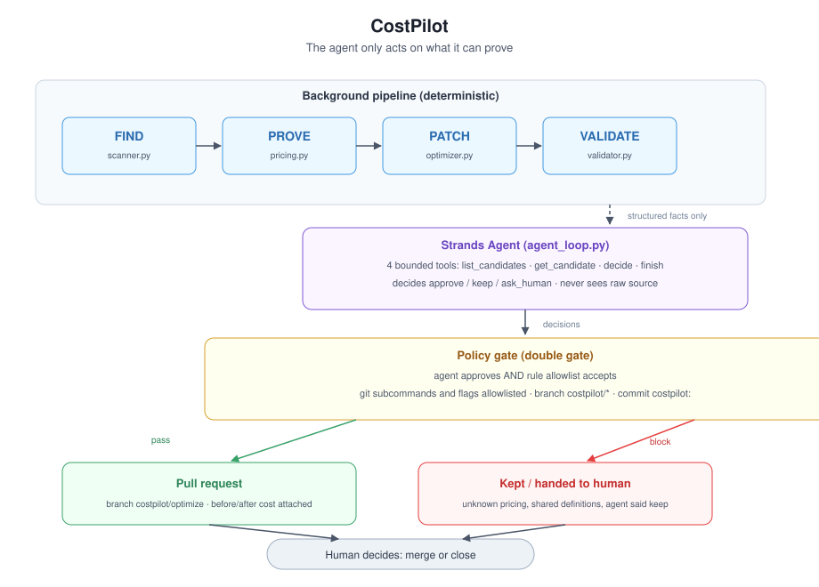

# CostPilot

An agent that finds expensive LLM calls in your code, prices them against public rate cards, and only proposes a change when it can prove the saving. If it can't prove it, it leaves the code alone and says so.

> "The agent runs autonomously and only surfaces when there's a real decision to make."
> (Agents for Humans Hackathon theme)

CostPilot was built for that sentence. It scans a repository, prices each LLM call, and surfaces exactly once: as a pull request with the math attached.

## The problem

LLM bills grow without anyone auditing them. Small teams find out weeks later, after the money is gone. Nobody wants to grep every `chat.completions` call and check the pricing page by hand.

## Who it's for

Developers and small teams who ship code that calls LLM APIs. If you know the bill is too high but don't have an afternoon to prove it, this is for you.

## How it works

FIND → PROVE → PATCH → VALIDATE → PR

| Step | Module | What happens |
|---|---|---|
| FIND | `scanner.py` | Static AST scan for LLM calls (OpenAI, Anthropic, LangChain) |
| PROVE | `pricing.py` | Price each call against public rate cards (three tiers) |
| PATCH | `optimizer.py` | Conservative model downgrade, only when provable |
| VALIDATE | `validator.py` | Syntax check, tests, re-scan. Allowlisted commands only |
| PR | `git_provider.py` | Branch `costpilot/*`, commit, change request with the numbers |



## Quickstart

The static path (`pipeline.py`: scan, price, recommend) needs no model, no API
keys, no network. The agentic loop uses Ollama by default.

```bash
# 1. core + dev (lint/types/tests) — enough for the static pipeline
git clone git@github.com:owain323/costpilot.git && cd costpilot
python -m venv .venv && source .venv/bin/activate

# Option A: exact reproducibility from the provided lock file
pip install -r requirements.lock
pip install -e .

# Option B: install from pyproject (may resolve to newer versions)
# pip install -e ".[dev]"

python run_checks.py
python costpilot/pipeline.py costpilot/tests/fixtures/sample_app.py 100

# 2. web demo (FastAPI + Uvicorn) — scan-only preview, no LLM
pip install -e ".[demo]"   # already installed if you used Option A + [dev]
uvicorn demo.app:app --port 8000
# open http://localhost:8000

# 3. agentic loop (Strands + Ollama, default local model)
ollama pull qwen2.5:7b   # local model, required by the agentic loop
python benchmark/demo_agentic.py
```

On Windows, activate the venv with `.venv\Scripts\activate` instead.

## See it work

- Real change request produced by CostPilot: [owain323/costpilot-demo pull #1](https://github.com/owain323/costpilot-demo/pull/1). Three model swaps on branch `costpilot/optimize`, about 80% cheaper per 1K calls, opened by the agent. The human review is on the record on that PR: the price math and the tests check out, and the merge is deliberately on hold pending output-quality spot checks. That hold is the design working.
- Demo target repo: [owain323/costpilot-demo](https://github.com/owain323/costpilot-demo)
- Live scan-only demo: [costpilot.owain32380.cn](https://costpilot.owain32380.cn) — paste code, see call sites, prices, and conservative downgrades. The **Pricing basis** panel (expandable below the summary) shows the public rate-card rows used for *this* scan: every model involved, its input/output price per 1M tokens, and an explicit "not in table" row for anything unpriced. No hidden assumptions.
- Two artifacts, two runs, shown unedited. The pull request came from the deterministic pipeline run (three swaps, 80%). The recorded agentic run then applied the stricter four-criteria loop and approved one downgrade (94% modeled saving) while handing a constant-derived model to a human. Different gates, same rule: no proof, no change.
- Local PR artifact sample: `benchmark/artifacts/costpilot__optimize.md`
- Reproduce the benchmark: `python benchmark/benchmark.py` (auto-fetches pinned repos, SHA-locked, results match `benchmark-report.json`)

## What it does and doesn't do

- It rewrites only literal model strings (`model="gpt-4o"` to `"gpt-4o-mini"`). Models that come from constants, config, or env vars are left to a human; changing a shared definition affects every caller.
- The agent never touches a raw shell. Git subcommands and flags are allowlisted, branch names must start with `costpilot/`, commit messages with `costpilot:`.
- A change needs two approvals: the agent's and the rule allowlist. In our live run, the LLM approved a constant-derived model swap; the rule layer blocked it.
- If validation fails, the working tree is rolled back. No commit, no change request, nothing left dirty.
- The agent sees structured facts (file, line, model, confidence, cost), not your source code. The schema is constrained, and every write still passes the policy gate.

## On honesty

Most real-world LLM calls (~95%) use models we can't price from public data. CostPilot says "unknown" and keeps the code as is. No guesswork, no made-up numbers. Every saving is labeled as price potential from public rate cards, not a realized bill. The web demo shows its working: the Pricing basis panel lists the exact unit prices (USD per 1M tokens, 2026-08 snapshot from vendor public pricing pages) and the token assumptions (~3.5 chars/token, output 512 tokens unless set), so anyone can reproduce the math by hand.

## Downgrade safety criteria

"Prove the saving" means prove that a proposed change satisfies an explicit, named checklist. It does not mean proving two models are semantically equivalent.

A downgrade is proposed only when all four criteria hold:

1. **Priced**: the source and target models are both in the public price table.
2. **Literal**: the model comes from a string literal at the call site, not a shared constant, config, or env var (changing a literal affects one call).
3. **Bounded**: the prompt is short and the output is bounded (`max_tokens` within the downgrade budget).
4. **Green**: the repository's own tests still pass after the patch.

What is not evaluated, and never claimed: output quality, refusal rate, JSON schema stability, tool-calling behavior, latency, and token-usage variance of the target model. The PR artifact lists these explicitly as the human's checklist at merge time. The artifact never claims semantic equivalence; that decision belongs to the human reviewing the diff.

## Model providers

- Ollama (default, local, free, offline). Tested with `qwen2.5:7b`.
- AWS Bedrock (optional): set `COSTPILOT_MODEL_PROVIDER=bedrock` and `COSTPILOT_BEDROCK_MODEL`. Needs AWS credentials and the `bedrock` extra (`pip install -e ".[bedrock]"`).

## Why Strands

The decision step is a real Strands agent, not a prompt. It gets four bounded
tools and nothing else: `list_candidates`, `get_candidate`, `decide`, `finish`.
That shape is deliberate.

- The agent reads a constrained evidence schema (file, line, model, source,
  confidence, cost) and never sees your source text.
- It can only end a review by calling `decide` (approve / keep / ask_human),
  so its output is always a machine-checkable decision, never free text.
- A change is executed only when the agent approves it and the rule allowlist
  accepts it. Two gates, because a model can be overconfident and a rule can
  be wrong; together they are conservative.

The same agent loop runs on local Ollama by default or on Amazon Bedrock via
the provider factory (`COSTPILOT_MODEL_PROVIDER=bedrock`).

## Scanner coverage (what the static scan does not catch)

The scanner is a high-confidence rule system, not a full dataflow analysis. It
detects direct SDK calls, known wrappers, and Strands agent construction. It
does not follow dynamic reflection, and LangChain `.invoke()` chains after a
constructor are only partially tracked (measured recall on our benchmark repo
is 0% for that specific pattern). Missed patterns cost nothing: they simply
stay unoptimized. The benchmark report lists these numbers honestly.

## License

MIT
